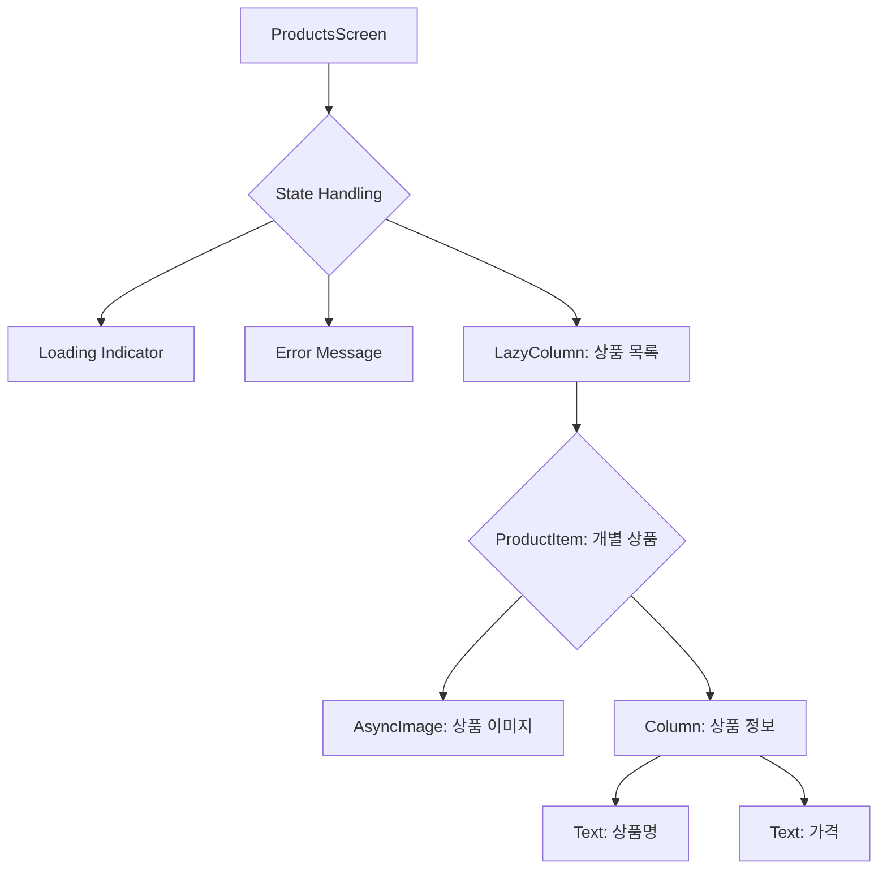

# app_18_fake_store 디자인 명세

## 1. 기능 및 UI 요구사항

이 모듈은 'Fake Store API'를 사용하여 원격 서버로부터 상품 목록을 가져와 화면에 표시하는 것을 목표로 합니다.

- **핵심 기능**:
  - Retrofit 라이브러리를 사용하여 REST API(`https://fakestoreapi.com/products`)를 호출하고 상품 데이터를 수신합니다.
  - 수신된 JSON 데이터를 Kotlin 데이터 클래스(`Product`)로 파싱합니다.
  - Dagger/Hilt를 사용한 의존성 주입(DI) 아키텍처를 구현합니다.
  - `ViewModel`을 사용하여 UI 상태를 관리하고 비즈니스 로직을 처리합니다.

- **UI 요구사항**:
  - 화면에 상품 목록을 세로 스크롤 형태로 표시합니다 (`LazyColumn`).
  - 각 상품 아이템은 상품 이미지, 상품명, 가격을 포함해야 합니다.
  - Coil 라이브러리를 사용하여 상품 이미지 URL을 비동기적으로 로드하고 표시합니다.
  - 데이터 로딩 중에는 로딩 인디케이터(예: `CircularProgressIndicator`)를 표시합니다.
  - API 호출 실패 시 에러 메시지를 표시합니다.

---

## 2. 프로젝트 구조

모듈은 안드로이드 권장 아키텍처 가이드에 따라 `data`, `domain`, `presentation` 계층으로 구분됩니다.

```
app_18_fake_store/
├── src/main/
│   ├── java/com/example/app_18_fake_store/
│   │   ├── di/
│   │   │   └── AppModule.kt            # Hilt 의존성 주입 모듈
│   │   │
│   │   ├── store/
│   │   │   ├── data/
│   │   │   │   ├── remote/
│   │   │   │   │   └── FakeStoreApi.kt     # Retrofit API 인터페이스
│   │   │   │   └── repository/
│   │   │   │       └── ProductsRepositoryImpl.kt # 데이터 소스 구현체
│   │   │   │
│   │   │   ├── domain/
│   │   │   │   ├── model/
│   │   │   │   │   └── Product.kt          # 상품 데이터 클래스
│   │   │   │   └── repository/
│   │   │   │       └── ProductsRepository.kt # 데이터 소스 추상 인터페이스
│   │   │   │
│   │   │   └── presentation/
│   │   │       ├── products_screen/
│   │   │       │   ├── ProductsScreen.kt   # 메인 UI 컴포저블
│   │   │       │   ├── ProductsViewModel.kt # 화면의 상태와 로직 관리
│   │   │       │   └── ProductsState.kt    # UI 상태 데이터 클래스
│   │   │       └── util/
│   │   │           └── Screen.kt           # (필요시) 내비게이션 경로 정의
│   │   │
│   │   ├── ui/
│   │   │   └── theme/                    # Compose 테마
│   │   │
│   │   ├── FakeStoreApp.kt             # Hilt 설정을 위한 Application 클래스
│   │   └── MainActivity.kt             # 앱의 메인 진입점
│   │
│   └── AndroidManifest.xml
│
└── build.gradle.kts
```

---

## 3. UI 구조 개요 (Mermaid)



---

## 4. 주요 컴포저블 설명

- **`ProductsScreen`**:
  - 화면의 전체적인 레이아웃을 구성하는 최상위 컴포저블입니다.
  - `ProductsViewModel`로부터 UI 상태(`ProductsState`)를 구독(observe)합니다.
  - 상태에 따라 로딩 인디케이터, 에러 메시지, 또는 상품 목록(`LazyColumn`)을 조건부로 렌더링합니다.

- **`ProductItem`**:
  - `LazyColumn` 내에서 개별 상품 하나를 표시하는 컴포저블입니다.
  - `Product` 객체를 인자로 받아 UI에 필요한 데이터를 바인딩합니다.
  - `Row` 또는 `Column`을 사용하여 이미지와 텍스트 정보를 배치합니다.

- **`AsyncImage` (Coil)**:
  - `ProductItem` 내에서 상품 이미지를 표시하는 데 사용됩니다.
  - `model` 인자로 상품의 이미지 URL을 전달받아 비동기적으로 이미지를 로드하고 표시합니다.
  - 로딩 중이나 실패 시 보여줄 플레이스홀더(placeholder)나 에러 이미지를 설정할 수 있습니다.


## Gemini CLI:
-  이 모듈을 처음부터 다시 하나 하나 step-by-step 만들어 보려고 해. 전체적인 단계를 체계적으로 설명해줘.

✦ 네, app_18_fake_store 모듈을 처음부터 체계적으로 다시 만들어보는 과정을 단계별로 설명해 드리겠습니다. 이
  과정은 일반적인 안드로이드 클린 아키텍처(Clean Architecture)를 따르며, 각 계층을 순서대로 구축합니다.

  Phase 0: 프로젝트 준비 (Project Preparation)

  가장 먼저, 새로운 모듈을 만들고 필요한 라이브러리를 설정하는 준비 단계입니다.

   1. 신규 모듈 생성:
       * Android Studio에서 File > New > New Module...을 선택합니다.
       * Application 템플릿을 선택하고 모듈 이름을 app_18_fake_store로 지정합니다.
       * 프로젝트 GEMINI.md 가이드에 따라 minSDK는 32, targetSDK는 35로 설정합니다.

   2. `build.gradle.kts` 의존성 추가:
       * 모듈 수준의 build.gradle.kts 파일을 열고 다음 라이브러리들을 추가합니다.
           * Jetpack Compose: UI 툴킷 (compose.ui, compose.material3, compose.tooling)
           * Lifecycle & ViewModel: lifecycle-viewmodel-compose
           * Hilt: 의존성 주입을 위해 hilt-android, hilt-navigation-compose 및 KAPT/KSP 플러그인 설정
           * Retrofit & OkHttp: 네트워크 통신을 위해 retrofit, converter-gson
           * Coil: 이미지 로딩을 위해 coil-compose

   3. `AndroidManifest.xml` 설정:
       * 인터넷 통신을 위해 <uses-permission android:name="android.permission.INTERNET" /> 권한을 추가합니다.
       * Hilt를 사용하기 위해 <application> 태그에 android:name=".FakeStoreApplication" 속성을 추가할 준비를
         합니다.

  Phase 1: 데이터 계층 구축 (Data Layer)

  네트워크 또는 데이터베이스에서 데이터를 가져오는 역할을 담당합니다. API 연동부터 시작하겠습니다.

   1. DTO (Data Transfer Object) 정의:
       * store/data/remote/ 패키지에 ProductDto.kt 파일을 생성합니다.
       * 이 클래스는 Fake Store API가 반환하는 JSON 객체의 구조와 정확히 일치해야 합니다. API 응답을 보고
         필드를 정의합니다.

   2. API 인터페이스 생성 (Retrofit):
       * store/data/remote/ 패키지에 ProductsApi.kt 인터페이스를 생성합니다.
       * Retrofit의 @GET("products") 어노테이션을 사용하여 상품 목록을 가져오는 suspend fun getProducts():
         List<ProductDto> 함수를 정의합니다.

   3. Repository 구현체 생성:
       * store/data/repository/ 패키지에 ProductsRepositoryImpl.kt 클래스를 생성합니다.
       * 이 클래스는 ProductsApi를 주입받아 실제 네트워크 요청을 수행합니다.
       * API로부터 받은 List<ProductDto>를 앱의 다른 부분에서 사용할 List<Product> (도메인 모델)로 변환하는
         로직을 포함합니다.

  Phase 2: 도메인 계층 구축 (Domain Layer)

  애플리케이션의 핵심 비즈니스 로직을 담당하며, 다른 계층에 의존하지 않는 순수한 코드로 작성됩니다.

   1. 도메인 모델 정의:
       * store/domain/model/ 패키지에 Product.kt 데이터 클래스를 생성합니다.
       * 이 모델은 UI에 표시될 실제 상품 데이터를 나타냅니다. DTO와 구조가 다를 수 있으며, UI에 필요한
         데이터만 포함하도록 설계합니다.

   2. Repository 인터페이스 정의:
       * store/domain/repository/ 패키지에 ProductsRepository.kt 인터페이스를 생성합니다.
       * 데이터를 가져오는 행위에 대한 명세(규칙)를 정의합니다. 예를 들어, suspend fun getProducts():
         List<Product> 와 같은 함수를 선언합니다.
       * 핵심: ViewModel은 이 인터페이스에만 의존하고, 실제 구현체(ProductsRepositoryImpl)는 알지 못하게 하여
         계층 간의 결합도를 낮춥니다.

  Phase 3: 의존성 주입 설정 (Dependency Injection with Hilt)

  각 계층에서 필요한 객체(의존성)를 Hilt가 자동으로 주입하도록 설정합니다.

   1. Application 클래스 생성:
       * 루트 패키지에 FakeStoreApplication.kt 파일을 만들고 Application을 상속받게 합니다.
       * 클래스 위에 @HiltAndroidApp 어노테이션을 붙여 Hilt의 시작점임을 알립니다.
       * AndroidManifest.xml의 <application> 태그에 android:name=".FakeStoreApplication"을 설정합니다.

   2. Hilt 모듈 생성:
       * di 패키지에 AppModule.kt와 RepositoryModule.kt 객체(object)를 생성합니다.
       * `AppModule.kt`: Retrofit, OkHttpClient, ProductsApi 인스턴스를 생성하여 제공하는 @Provides 함수들을
         정의합니다.
       * `RepositoryModule.kt`: ProductsRepository 인터페이스의 구현체로 ProductsRepositoryImpl를 사용하도록
         @Binds 어노테이션으로 지정합니다.

  Phase 4: 프리젠테이션 계층 구축 (Presentation Layer)

  사용자에게 보여지는 UI와 사용자 입력을 처리하는 로직을 구현합니다.

   1. 화면 상태(View State) 정의:
       * products_screen 패키지에 ProductsViewState.kt 데이터 클래스를 생성합니다.
       * 화면에 필요한 모든 상태(상품 목록, 로딩 상태, 에러 메시지 등)를 이 클래스 하나로 관리합니다.

   2. ViewModel 생성:
       * products_screen 패키지에 ProductsViewModel.kt 클래스를 생성합니다.
       * @HiltViewModel 어노테이션을 붙이고, 생성자에서 @Inject를 통해 ProductsRepository를 주입받습니다.
       * StateFlow를 사용하여 ProductsViewState를 관리하고, getProducts() 함수를 호출하여 데이터를 가져온 뒤
         ViewState를 업데이트하는 로직을 구현합니다.

   3. UI 컴포저블 생성:
       * `ProductCard.kt`: 상품 하나를 표시하는 재사용 가능한 컴포저블을 components 패키지에 만듭니다. Coil
         라이브러리를 사용하여 이미지를 표시합니다.
       * `ProductsScreen.kt`: ViewModel로부터 ProductsViewState를 collectAsStateWithLifecycle로 구독합니다.
           * State에 따라 로딩 인디케이터, 상품 목록(LazyColumn과 ProductCard 사용), 또는 에러 화면을 조건부로
              표시합니다.

   4. Activity 설정:
       * MainActivity.kt에 @AndroidEntryPoint 어노테이션을 추가합니다.
       * setContent 블록 안에서 ProductsScreen() 컴포저블을 호출하여 화면을 표시합니다.

  Phase 5: 최종 조립 및 개선 (Final Assembly & Refinement)

  모든 조각을 맞추고 앱의 완성도를 높입니다.

   1. 네비게이션 및 화면 구성: 현재는 단일 화면이므로 MainActivity에서 바로 ProductsScreen을 보여주면 됩니다.
   2. UI 개선: LoadingDialog.kt, MyTopAppBar.kt 같은 공용 컴포넌트를 만들어 UI를 더 깔끔하게 다듬습니다.
   3. 코드 리뷰 및 주석: GEMINI.md 가이드라인에 따라 각 코드 블록의 역할과 이유에 대해 상세한 주석을
      추가합니다.
   4. 빌드 및 실행: 앱을 빌드하고 실행하여 모든 기능이 정상적으로 동작하는지 확인합니다.

  이 단계를 순서대로 따라가면, 아키텍처가 잘 분리되고 테스트와 유지보수가 용이한 app_18_fake_store 모듈을
  완성할 수 있습니다.
