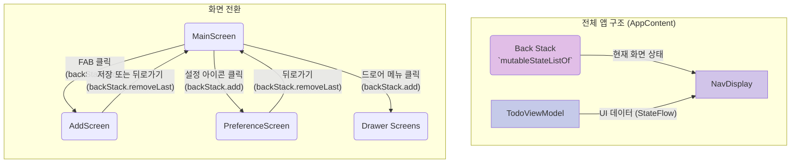

# Todo Revised 앱 명세 및 개발 가이드

## 1. UI 요구사항

이 앱은 Jetpack Compose, Room, DataStore를 사용하여 "할 일(Todo)" 목록 애플리케이션을 만드는 것을 목표로 합니다.

*   **메인 화면 (`MainScreen`)**:
    *   상단 바에 "Todo Revised" 제목과 내비게이션 드로어 아이콘이 표시됩니다.
    *   설정 화면으로 이동하는 설정 아이콘이 표시됩니다.
    *   할 일 목록이 비어있을 경우, "할 일이 없습니다."라는 안내 문구가 표시됩니다.
    *   할 일 목록이 있을 경우, 각 항목이 내용과 생성 시간으로 구성된 리스트로 표시됩니다.
    *   화면 우측 하단에 할 일을 추가하는 화면으로 이동하는 Floating Action Button(FAB)이 있어야 합니다.

*   **할 일 추가 화면 (`AddScreen`)**:
    *   상단 바에 "Add Todo"라는 제목과 뒤로가기 버튼이 표시됩니다.
    *   새로운 할 일을 입력받는 텍스트 필드가 있어야 합니다.
    *   "저장" 버튼을 클릭하면 입력된 할 일이 메인 화면의 목록에 추가되고 이전 화면으로 돌아갑니다.

*   **설정 화면 (`PreferenceScreen`)**:
    *   상단 바에 "앱 설정"이라는 제목과 뒤로가기 버튼이 표시됩니다.
    *   할 일 목록의 정렬 순서(시간 순, 이름 순)를 변경할 수 있는 옵션을 제공합니다.

*   **내비게이션 드로어**:
    *   `BatteryStatusScreen`, `GalleryScreen`, `Mp3PlayerScreen` 등 추가 기능 화면으로 이동할 수 있는 메뉴를 제공합니다.

## 2. UI 구조 개요

이 앱은 `navigation3` 라이브러리의 `NavDisplay`를 사용하여 화면을 전환합니다. 화면의 백스택(Back Stack)은 `mutableStateListOf<Route>`로 관리됩니다.



## 3. 주요 개념 설명

*   **`NavDisplay`**: `navigation3`의 핵심 컴포저블로, 백스택(`backStack`)의 마지막 항목에 해당하는 화면을 표시합니다.
*   **상태 기반 내비게이션**: `remember { mutableStateListOf<Route>() }`로 생성된 리스트의 상태가 내비게이션 그래프 역할을 합니다.
    *   `backStack.add(Screen)`: 새로운 화면으로 이동합니다.
    *   `backStack.removeLastOrNull()`: 이전 화면으로 돌아갑니다.
*   **`sealed interface Route`**: 앱의 모든 화면(경로)을 타입 안전하게 정의합니다.
*   **MVVM 아키텍처**: `ViewModel`이 데이터(Model)와 UI(View) 사이의 상호작용을 관리합니다.
    *   **StateFlow**: `ViewModel`은 `Flow`를 `StateFlow`로 변환하여 UI가 관찰할 수 있는 데이터 스트림을 제공합니다. Compose UI는 `collectAsState()`를 통해 `StateFlow`의 변경을 감지하고 자동으로 리컴포지션됩니다.
    *   **단방향 데이터 흐름 (UDF)**: UI는 `ViewModel`의 데이터를 구독하여 화면을 그리고, 사용자 이벤트는 `ViewModel`의 함수를 호출하여 데이터 변경을 요청합니다. 데이터는 항상 `ViewModel`에서 UI 방향으로 흐릅니다.
*   **`Scaffold`**: 각 화면의 기본 구조를 제공하며, `TopAppBar`, `FloatingActionButton`, `ModalNavigationDrawer` 등을 쉽게 배치할 수 있게 해줍니다.

---

## 🚀 Todo Revised 앱 개발 단계별 가이드 (Room & DataStore 사용)

이 가이드는 간단한 Todo 앱을 영속적인 데이터 저장소(Room)와 사용자 설정 관리(DataStore) 기능을 갖춘 **Todo Revised** 앱으로 확장하는 과정을 다룹니다.

### 1단계: 프로젝트 준비 및 Dependency 설정 🛠️

`build.gradle.kts` 파일에 데이터 영속성, 비동기 처리, ViewModel 등을 위한 라이브러리를 추가합니다.

```kotlin
// build.gradle.kts (todo_revised 모듈)

dependencies {
    // ...
    // DataStore (사용자 설정 저장)
    implementation("androidx.datastore:datastore-preferences:1.1.1")

    // Room (데이터베이스 - 할 일 목록 저장)
    implementation(libs.androidx.room.runtime)
    implementation(libs.androidx.room.ktx)
    ksp(libs.androidx.room.compiler)
    
    // Kotlinx Serialization
    implementation(libs.kotlinx.serialization.core)
    
    // ViewModel - Compose 연동
    implementation(libs.androidx.lifecycle.viewmodel.compose)
    // ...
}
```

> 💡 **KSP (Kotlin Symbol Processing)**: Room 라이브러리가 `@Entity`나 `@Dao` 같은 어노테이션을 인식하고, 컴파일 시점에 필요한 코드를 자동으로 생성하도록 돕는 도구입니다.

### 2단계: 데이터베이스 (Room) 구현 🗄️

할 일 목록을 앱을 종료해도 유지되도록 **Room Database**를 설정합니다.

#### 1. 엔티티 (Entity) 정의: `TodoItem.kt`

데이터베이스 테이블 구조를 정의합니다.

```kotlin
// data/local/TodoItem.kt
import androidx.room.Entity
import androidx.room.PrimaryKey

@Entity(tableName = "todo_items")
data class TodoItem(
    @PrimaryKey(autoGenerate = true)
    val id: Int = 0,
    val task: String, // 할 일 내용
    val createdAt: Long = System.currentTimeMillis() // 생성 시간 (정렬 기준)
)
```

#### 2. DAO (Data Access Object) 정의: `TodoDao.kt`

데이터베이스에 접근하는 메서드(쿼리)를 정의합니다. `Flow`를 사용하여 데이터 변경을 실시간으로 UI에 반영합니다.

```kotlin
// data/local/TodoDao.kt
@Dao
interface TodoDao {
    @Insert(onConflict = OnConflictStrategy.REPLACE)
    suspend fun insert(item: TodoItem)

    @Update
    suspend fun update(item: TodoItem)

    @Delete
    suspend fun delete(item: TodoItem)

    @Query("SELECT * FROM todo_items ORDER BY createdAt DESC")
    fun getTodosSortedByTime(): Flow<List<TodoItem>>

    @Query("SELECT * FROM todo_items ORDER BY task ASC")
    fun getTodosSortedByName(): Flow<List<TodoItem>>
}
```

#### 3. Room Database 클래스: `AppDatabase.kt`

싱글톤 패턴으로 데이터베이스 인스턴스를 생성하고 관리하는 추상 클래스를 정의합니다.

```kotlin
// data/local/AppDatabase.kt
@Database(entities = [TodoItem::class], version = 1, exportSchema = false)
abstract class AppDatabase : RoomDatabase() {
    abstract fun todoDao(): TodoDao

    companion object {
        @Volatile
        private var INSTANCE: AppDatabase? = null

        fun getDatabase(context: Context): AppDatabase {
            // ... 싱글톤 인스턴스 반환 로직 ...
        }
    }
}
```

### 3단계: 사용자 설정 (DataStore) 구현 ⚙️

정렬 순서(`SortOrder`)와 같은 사용자 설정을 영구적으로 저장하고 관리합니다.

#### 설정 Repository: `SettingsRepository.kt`

```kotlin
// data/settings/SettingsRepository.kt
private val Context.dataStore: DataStore<Preferences> by preferencesDataStore(name = "settings")

enum class SortOrder { TIME, TASK_NAME }

class SettingsRepository(private val context: Context) {
    private val SORT_ORDER_KEY = stringPreferencesKey("sort_order")

    val sortOrderFlow: Flow<SortOrder> = context.dataStore.data
        .map { preferences ->
            SortOrder.valueOf(preferences[SORT_ORDER_KEY] ?: SortOrder.TIME.name)
        }

    suspend fun updateSortOrder(sortOrder: SortOrder) {
        context.dataStore.edit { preferences ->
            preferences[SORT_ORDER_KEY] = sortOrder.name
        }
    }
}
```

### 4단계: ViewModel 통합 (MVVM 패턴) 🧠

`TodoViewModel`은 Room과 DataStore의 데이터를 UI에 연결하고, `SortOrder` 변경에 따라 Room 쿼리를 동적으로 변경합니다.

#### `TodoViewModel.kt` 핵심 로직

```kotlin
// viewmodel/TodoViewModel.kt
class TodoViewModel(application: Application) : AndroidViewModel(application) {
    
    private val todoDao = AppDatabase.getDatabase(application).todoDao()
    private val settingsRepository = SettingsRepository(application)
    
    // 1. 정렬 순서(DataStore)를 StateFlow로 UI에 노출
    val sortOrder: StateFlow<SortOrder> = settingsRepository.sortOrderFlow
        .stateIn(/* ... */)

    fun updateSortOrder(newSortOrder: SortOrder) { /* ... */ }

    // 2. **핵심**: sortOrder 변경을 감지하여 DB 쿼리(Flow)를 동적으로 전환
    @OptIn(kotlinx.coroutines.ExperimentalCoroutinesApi::class)
    val todoItems: StateFlow<List<TodoItem>> = settingsRepository.sortOrderFlow
        .flatMapLatest { sortOrder -> // DataStore 값이 바뀔 때마다 실행
            when (sortOrder) {
                SortOrder.TIME -> todoDao.getTodosSortedByTime()
                SortOrder.TASK_NAME -> todoDao.getTodosSortedByName()
            }
        }.stateIn(/* ... */)

    // 데이터 조작 함수 (CRUD)
    fun addTodo(task: String) = viewModelScope.launch { /* ... */ }
    fun updateTodo(item: TodoItem) = viewModelScope.launch { /* ... */ }
    fun deleteTodo(item: TodoItem) = viewModelScope.launch { /* ... */ }
}
```

> 💡 **`flatMapLatest`의 역할**: `sortOrderFlow`에서 새로운 정렬 순서가 발행될 때마다, 이전의 DB 쿼리 구독을 취소하고 새로운 정렬 기준에 맞는 쿼리(Flow)로 동적으로 전환합니다.

### 5단계: Compose UI와 ViewModel 연결 🖥️

`MainActivity.kt`의 `AppContent`에서 `TodoViewModel`을 사용하여 UI와 데이터를 연결합니다.

```kotlin
// MainActivity.kt - AppContent() 함수 내
@Composable
fun AppContent() {
    // 1. ViewModel 인스턴스 가져오기
    val todoViewModel: TodoViewModel = viewModel()
    
    // 2. ViewModel의 StateFlow를 구독하여 Compose State로 변환
    val todoItems by todoViewModel.todoItems.collectAsState()
    val sortOrder by todoViewModel.sortOrder.collectAsState()
    
    // ... ModalNavigationDrawer, Scaffold ...
    
    NavDisplay(
        backStack = backStack,
        entryProvider = { route ->
            when (route) {
                is MainScreen -> NavEntry(route) {
                    MainScreenContent(
                        items = todoItems,
                        sortOrder = sortOrder
                    )
                }
                is AddScreen -> NavEntry(route) {
                    AddScreenContent(
                        onBack = { backStack.removeLastOrNull() },
                        // 3. 저장 로직을 ViewModel에 위임
                        onSave = { item ->
                            todoViewModel.addTodo(item.task)
                            backStack.removeLastOrNull()
                        }
                    )
                }
                is PreferenceScreen -> NavEntry(route) {
                    PreferenceScreen(
                        onNavigateBack = { backStack.removeLastOrNull() }
                    )
                }
                // ... 다른 화면들
            }
        }
    )
}
```

### 6단계: 화면 컴포넌트(Composable) 구현

#### `MainScreenContent.kt` (메인 화면)

```kotlin
@Composable
fun MainScreenContent(items: List<TodoItem>, sortOrder: SortOrder) {
    if (items.isEmpty()) {
        Text("할 일이 없습니다. 새로운 할 일을 추가해보세요!", /* ... */)
    } else {
        LazyColumn(/* ... */) {
            items(items, key = { it.id }) { item ->
                TodoItem(item = item)
            }
        }
    }
}

@Composable
fun TodoItem(item: TodoItem) {
    Column(modifier = Modifier.padding(16.dp)) {
        Text(text = item.task, style = MaterialTheme.typography.bodyLarge)
        Text(text = "생성: ${formatTime(item.createdAt)}", style = MaterialTheme.typography.bodySmall)
    }
}
```

#### `AddScreenContent.kt` (할 일 추가 화면)

```kotlin
@Composable
fun AddScreenContent(onSave: (item: TodoItem) -> Unit, onBack: () -> Unit) {
    var todoText by remember { mutableStateOf("") }
    Scaffold(topBar = { /* ... 뒤로가기 버튼 ... */ }) {
        Column(modifier = Modifier.padding(it)) {
            OutlinedTextField(value = todoText, onValueChange = { todoText = it })
            Button(
                onClick = { if (todoText.isNotBlank()) onSave(TodoItem(task = todoText)) },
                enabled = todoText.isNotBlank()
            ) {
                Text("저장")
            }
        }
    }
}
```

#### `PreferenceScreen.kt` (설정 화면)

```kotlin
@Composable
fun PreferenceScreen(viewModel: TodoViewModel = viewModel(), onNavigateBack: () -> Unit) {
    val currentSortOrder by viewModel.sortOrder.collectAsState()
    Scaffold(topBar = { /* ... 뒤로가기 버튼 ... */ }) {
        Column(modifier = Modifier.padding(it)) {
            // "시간 순", "이름 순" RadioButton 옵션 제공
            radioOptions.forEach { (text, sortOrder) ->
                Row(Modifier.selectable(selected = (currentSortOrder == sortOrder),
                    onClick = { viewModel.updateSortOrder(sortOrder) })
                ) {
                    RadioButton(selected = (currentSortOrder == sortOrder), onClick = null)
                    Text(text)
                }
            }
        }
    }
}
```
